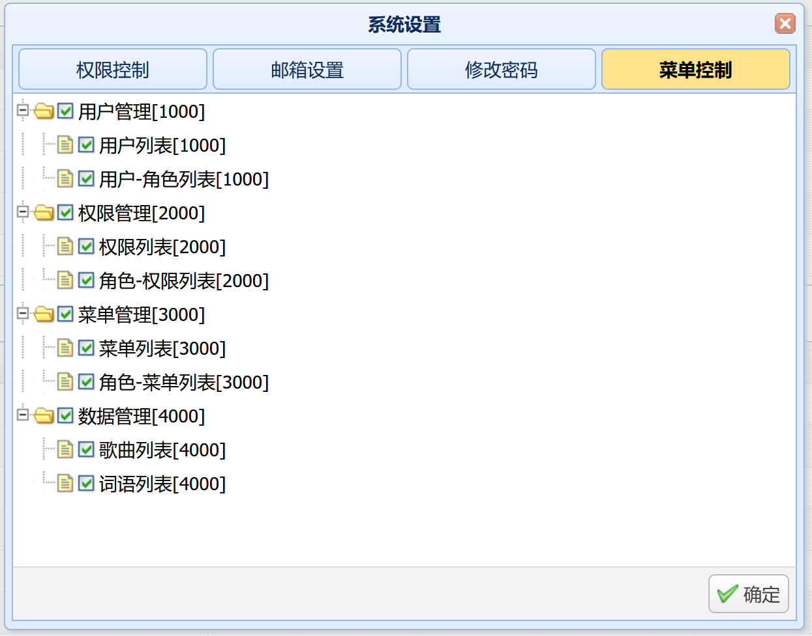
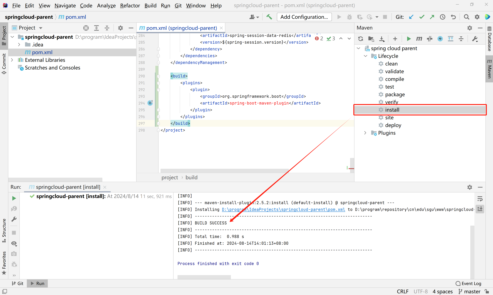

# easyui-admin

## 一、项目介绍

> 基于jquery easyui前端框架实现的管理系统项目，实现了权限控制、菜单控制等关键的系统功能。
>


## 二、技术介绍

### 1、后端技术

| 技术         | 说明                | 官网                                        |
| ------------ | ------------------- | ------------------------------------------- |
| Spring Boot  | 容器+MVC框架        | https://spring.io/projects/spring-boot      |
| Apache Shiro | 认证和授权框架      | https://shiro.apache.org/                   |
| MyBatis      | ORM框架             | https://blog.mybatis.org/                   |
| MyBatis-Plus | MyBatis增强工具     | https://www.baomidou.com/                   |
| Knife4j      | 接口文档生成工具    | https://doc.xiaominfo.com/docs/quick-start/ |
| Redis        | 分布式缓存数据库    | https://redis.io/                           |
| Flyway       | 数据库版本管理工具  | https://github.com/flyway/flyway            |
| Fastjson     | 序列化/反序列化工具 | https://github.com/alibaba/fastjson         |
| Easy Excel   | 操作excel的工具     | https://easyexcel.opensource.alibaba.com/   |


### 2、前端技术

| 技术          | 说明           | 官网                           |
| ------------- | -------------- | ------------------------------ |
| JQuery Easyui | 前端UI框架     | https://www.jeasyui.net/       |
| JQuery        | Javascript库   | https://jquery.com/            |
| Ajax          | 前后端交互框架 | https://learn.jquery.com/ajax/ |
| HTML          | 超文本标记语言 | https://html.com/              |
| CSS           | 层叠样式表     | https://www.w3.org/Style/CSS/  |


## 三、功能介绍

1、通过excel工具easy-excel完成数据导入/导出；

2、基于easyui的js插件实现的表格数据过滤功能；

3、基于角色的权限访问控制功能，通过一个过滤器PermsFilter完成鉴权，在shiro配置类中不再配置未授权时重定向地址；

```java
package cn.edu.sgu.www.easyui.filter;

import cn.edu.sgu.www.easyui.restful.JsonResult;
import cn.edu.sgu.www.easyui.restful.ResponseCode;
import cn.edu.sgu.www.easyui.util.HttpUtils;
import com.alibaba.fastjson.JSON;
import lombok.extern.slf4j.Slf4j;
import org.apache.shiro.web.filter.authz.PermissionsAuthorizationFilter;

import javax.servlet.ServletRequest;
import javax.servlet.ServletResponse;
import javax.servlet.annotation.WebFilter;
import javax.servlet.http.HttpServletRequest;
import javax.servlet.http.HttpServletResponse;
import java.io.IOException;

/**
 * 定义PermsFilter过滤器（覆盖shiro的perms过滤器）
 * @author heyunlin
 * @version 1.0
 */
@Slf4j
@WebFilter
public class PermsFilter extends PermissionsAuthorizationFilter {

    @Override
    public boolean isAccessAllowed(ServletRequest req, ServletResponse resp, Object mappedValue) throws IOException {
        boolean accessAllowed = super.isAccessAllowed(req, resp, mappedValue);

        // 打印未授权提示
        if (!accessAllowed) {
            HttpServletRequest request = (HttpServletRequest) req;
            // 得到请求地址
            String requestURI = request.getRequestURI();

            String errorMessage = "正在访问未授权的资源：" + requestURI;

            log.debug(errorMessage);

            ResponseCode responseCode = ResponseCode.UNAUTHORIZED;

            // 获取HttpServletResponse对象
            HttpServletResponse response = HttpUtils.getResponse();

            response.setStatus(responseCode.getValue());
            response.setContentType("application/json;charset=UTF-8");

            // 构建返回对象
            JsonResult<Void> jsonResult = JsonResult.error(responseCode, errorMessage);

            response.getWriter().write(JSON.toJSONString(jsonResult));
        }

        return accessAllowed;
    }

}
```

4、基于角色的菜单管理功能，菜单直接分配给角色；

5、用户可以控制显示哪些菜单，基于角色的菜单自定义显示/隐藏；勾选则代表显示，取消勾选则隐藏。




## 四、常见问题

### 问题一

启动项目后，系统的功能使用不了，提示表不存在。

第一次启动项目时开启flyway，即修改spring.flyway.enabled的值为true

```yaml
spring:
  flyway:
    enabled: true # 第一次启动项目时，这个配置改成true
    encoding: UTF-8
    validate-on-migrate: true
    baseline-on-migrate: true
    sql-migration-separator: __
    table: flyway_schema_history
    locations: classpath:db/migration
```


### 问题二

不小心把用户对应角色的权限管理相关的权限取消了，导致访问权限管理相关接口失败，无法重新为角色分配权限管理功能的权限。

把system.settings.enable-authorization设置为false，然后重启项目，为角色分配完权限之后，再恢复成true

```yaml
# 系统设置
system:
  settings:
    enable-authorization: true # 是否开启鉴权
    enable-table-auto-creation: true # 是否自动创建数据库，在第一次启动项目时需要配置为true
```


### 问题三

启动项目时flyway报错：一般这个问题不是在第一次启动项目时出现的，关闭flyway即可

```yaml
spring:
  flyway:
    enabled: false
    encoding: UTF-8
    validate-on-migrate: true
    baseline-on-migrate: true
    sql-migration-separator: __
    table: flyway_schema_history
    locations: classpath:db/migration
```


### 问题四

pom.xml文件报错，父依赖找不到

```xml
<parent>
    <groupId>cn.edu.sgu.www</groupId>
    <artifactId>springcloud-parent</artifactId>
    <version>1.0-SNAPSHOT</version>
</parent>
```


拉取这个项目到本地

```
https://gitee.com/muyu-chengfeng/springcloud-parent.git
```


通过idea的maven插件install到本地仓库


